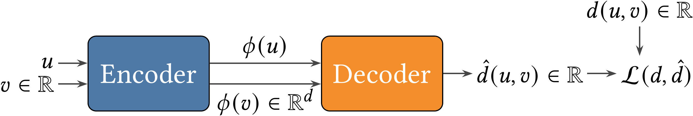
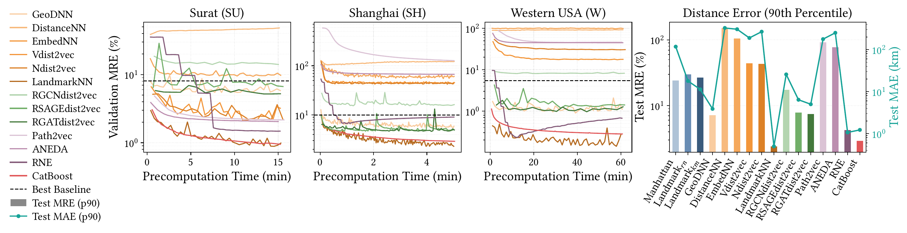
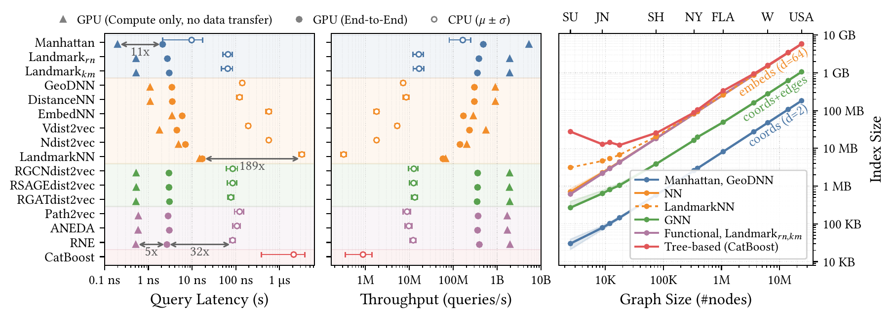
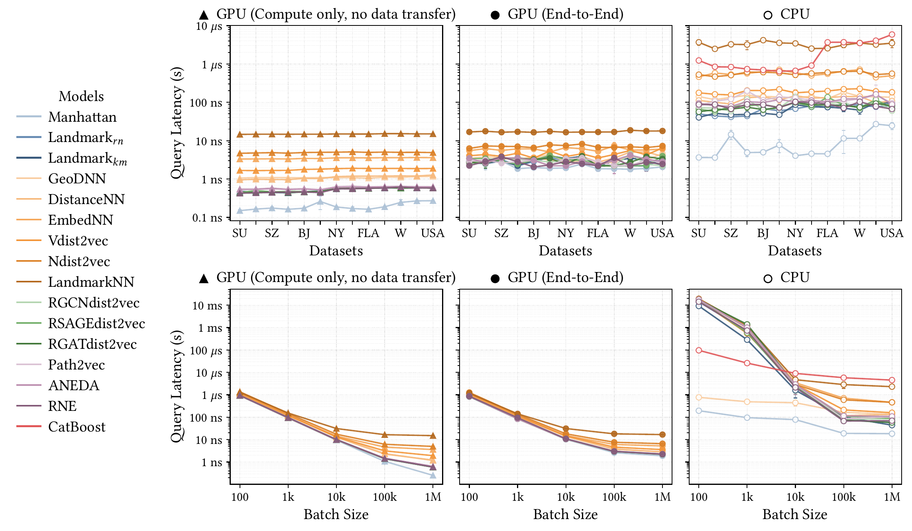

# An Empirical Survey and Benchmark of Learned Distance Indexes for Road Networks

<div align="center">

**Gautam Choudhary, Libin Zhou, Yeasir Rayhan, Walid G. Aref**

Purdue University

[](https://doi.org/10.1145/3841645.3842992)
[](https://github.com/purduedb/shortest-distance-survey)
[](https://purdue0-my.sharepoint.com/:f:/g/personal/gchoudha_purdue_edu/IgAmgeBcawEfQ6kplRlMyoA7Abfi3e3yxK6qKM8LRn_-Tlk?e=XRfvjl)
[](#)

**Accepted at ACM SIGSPATIAL 2026**

</div>

## Overview

This is the codebase for the first empirical survey and benchmark of ML-based distance indexes for shortest-path distance estimation in road networks. Road networks are modeled as undirected weighted graphs. The task is to approximate the shortest-path distance between two nodes without exact graph traversal. Methods are unified under an **encoder-decoder** framework and evaluated against classical non-ML baselines across real-world road networks on four dimensions: **accuracy**, **query latency**, **preprocessing time**, and **storage**.

<p align="center">
  
</p>

*Figure 1: Encoder-decoder abstraction. The encoder maps each node to a vector, and the decoder maps a pair of vectors to a distance estimate.*

The `src` directory contains all model implementations, and the `data` directory holds preprocessed datasets.

<details>
<summary><b>Methods (10)</b></summary>

| Type | Model (`src/models/<file>.py`) | Encoder | Decoder | Citation |
|---|---|---|---|---|
| Baseline | Manhattan (`lpnorm.py`) | Coordinates | L1-norm | — |
| Baseline | Landmark_rn (`landmark.py`, `--landmark_selection=random`) | Landmark distance vectors | minimum | Takes & Kosters 2014; Potamias et al. 2009 |
| Baseline | Landmark_km (`landmark.py`, `--landmark_selection=kmeans`) | Landmark distance vectors | minimum | Takes & Kosters 2014; Potamias et al. 2009 |
| NN | GeoDNN (`geodnn.py`) | Coordinates | NN(2d, 20, 100, 20, 1) | Jindal et al. 2017 |
| NN | DistanceNN (`distancenn.py`) | Pretrained embeddings | NN(d, 64, 12, 1) | Rizi et al. 2018 |
| NN | EmbedNN (`embeddingnn.py`) | Pretrained embeddings | NN(d, 500, 1) | Qu et al. 2023 |
| NN | Vdist2vec (`vdist2vec.py`) | Learnable embeddings | NN(2d, 100, 20, 1) | Qi et al. 2020 |
| NN | Ndist2vec (`ndist2vec.py`) | Learnable embeddings | 4×NN(2d, 100, 20, 1) | Chen et al. 2022 |
| NN | LandmarkNN (`catboostnn.py`) | Landmarks + coordinates | NN(2d, 1024, 512, 1) | — (ours; Jiang et al. 2021 features) |
| GNN | RGCNdist2vec (`rgnndist2vec.py`, `--gnn_layer=gcn`) | GCN | L1-norm | Meng et al. 2024 |
| GNN | RSAGEdist2vec (`rgnndist2vec.py`, `--gnn_layer=sage`) | GraphSAGE | L1-norm | — (ours; Hamilton et al. 2017 layer) |
| GNN | RGATdist2vec (`rgnndist2vec.py`, `--gnn_layer=gat`) | GAT | L1-norm | — (ours; Veličković et al. 2017 layer) |
| Functional | Path2Vec (`path2vec.py`) | Learnable embeddings | cosine distance | Kutuzov et al. 2019 |
| Functional | ANEDA (`aneda.py`) | Learnable embeddings | cosine distance | Pacini et al. 2023 |
| Functional | RNE (`rne.py`) | Hierarchical embeddings | L1-norm | Zhao et al. 2022 |
| GBDT | CatBoost (`catboostmodel.py`) | Landmarks + coordinates | GBDT | Jiang et al. 2021 |
| Exact (non-ML) | HC2L (`non_ml_index/`) | ground-truth oracle | — | Farhan et al. 2023 |

Full architecture details and design rationale for each method are in the paper (Section 3).

</details>

<details>
<summary><b>Datasets (13)</b></summary>

| Type | Dataset (code name) | Nodes | Edges | Queries | Citation |
|---|---|---:|---:|---:|---|
| All-pairs | Surat (`Surat`) | 2.5k | 3.6k | 6.3M | Karduni et al. 2016 |
| Workload-driven | Jinan (`W_Jinan`) | 8.9k | 14.1k | 500k | Figshare 2023 |
| Workload-driven | Shenzhen (`W_Shenzhen`) | 11.9k | 18.9k | 500k | Figshare 2023 |
| Workload-driven | Chengdu (`W_Chengdu`) | 17.6k | 25.3k | 500k | Wang et al. 2018 |
| Workload-driven | Beijing (`W_Beijing`) | 74.4k | 103.4k | 500k | Zheng et al. 2011; GeoLife 2024 |
| Workload-driven | Shanghai (`W_Shanghai`) | 74.9k | 103.0k | 500k | Shanghai-Taxi-Data 2023 |
| Workload-driven | New York (`W_NewYork`) | 334.9k | 445.9k | 500k | NYC Green Taxi 2016 |
| Workload-driven | Chicago (`W_Chicago`) | 386.5k | 549.6k | 500k | Chicago Taxi Trips 2020 |
| Landmark-based | Florida (`FLA`) | 1.1M | 1.3M | 32.1M | 9th DIMACS Challenge (Demetrescu et al. 2009) |
| Landmark-based | Eastern US (`E`) | 3.6M | 4.4M | 36.0M | 9th DIMACS Challenge (Demetrescu et al. 2009) |
| Landmark-based | Western US (`W`) | 6.3M | 7.6M | 31.3M | 9th DIMACS Challenge (Demetrescu et al. 2009) |
| Landmark-based | Central US (`CTR`) | 14.1M | 16.9M | 28.2M | 9th DIMACS Challenge (Demetrescu et al. 2009) |
| Landmark-based | Full US (`USA`) | 23.9M | 28.9M | 23.9M | 9th DIMACS Challenge (Demetrescu et al. 2009) |

Edge counts are undirected. Only `Surat` and `W_Jinan` ship with this repo. Full graph statistics are in [`data/README.md`](data/README.md).

</details>

## Getting Started

<details>
<summary><b>Directory Structure</b></summary>

```
├── analysis/               # Metrics extraction, plots, tables, and dashboard (post training)
├── archive/
├── data/                   # Preprocessed datasets
├── non_ml_index/           # Codebase for non-ML index
├── results/                # Saved logs, metrics, plots and model checkpoints
├── scripts/
├── slurm-jobs/             # SLURM job scripts for running experiments on HPC clusters
├── src/                    # Source code for this project
├── .gitignore
├── BACKUP.md
├── CONTRIBUTING.md
├── environment.yml         # Conda .yml file for recreating environment
├── LICENSE
└── README.md
```

</details>

### Install
Our code has been developed using PyTorch, PyTorch Geometric and Tensorflow in Python 3.12. Please refer to `environment.yml` for the complete list of dependencies.

```bash
# Clone the repository
git clone https://github.com/purduedb/shortest-distance-survey
cd shortest-distance-survey

# This will create environment (named `myenv`)
conda env create -f environment.yml
```

### Quick Usage
1. Activate the environment:
    ```bash
    # Load the conda module if using an HPC cluster, else skip `module` commands
    module load conda

    # Activate the conda environment
    conda activate myenv
    ```

2. Use sample preprocessed datasets: `W_Jinan` is available in `data/` directory. Other datasets are also available for download [here](https://purdue0-my.sharepoint.com/:f:/g/personal/gchoudha_purdue_edu/IgAmgeBcawEfQ6kplRlMyoA7Abfi3e3yxK6qKM8LRn_-Tlk?e=XRfvjl).

3. Train and evaluate a model:
    ```bash
    # Change to source directory
    cd src

    # Run RNE model with Jinan dataset
    python train.py --model_class rne --data_dir W_Jinan --query_dir real_workload_perturb_500k
    ```

    NOTE: Additional parameters, e.g., time_limit, learning_rate, seed, etc. may also be specified. Refer to argparse section in `train.py` for full list. Refer to `slurm-jobs/train_expt.sh` for other model configurations.

    Each run writes its outputs under `results/<expt>/`, named `<Model>_<Data>_<Query>`:
    - `saved_models/*.pt` — trained model checkpoint (state dict)
    - `saved_jit_models/*.jit.pt` — TorchScript model for C++ inference
    - `saved_metrics/metrics_*.json` — flat dict of all collected run info and metrics
    - `plots/*.png` — loss curves, target-vs-prediction, and MRE boxplots

4. Benchmark inference latency/throughput:
    ```bash
    # Export the trained checkpoint to ONNX
    python data_preprocess/export_onnx_models.py \
        --model_path ../results/default/saved_jit_models/RNE_W_Jinan_real_workload_perturb_500k.jit.pt

    # Benchmark latency/throughput on CPU
    python inference.py --backend tensorrt \
        --model_path ../results/default/saved_onnx_models/RNE_W_Jinan_real_workload_perturb_500k.onnx \
        --queries ../data/W_Jinan/real_workload_perturb_500k/W_Jinan_test.queries.npz \
        --device cpu --batch_sizes 100000,1000000 --eval_runs 10
    ```

    NOTE: CatBoost models are CPU-only and use `catboost_inference.py` instead (same flags, no `--backend`/`--device`). Refer to `slurm-jobs/inference_expt.sh` and `slurm-jobs/catboost_inference_expt.sh` for full configurations.

5. To train/evaluate multiple models across datasets (e.g. via SLURM on an HPC cluster), refer to `analysis/v9-camera-expt.md` for the complete end-to-end setup.

## Benchmark Results

<p align="center">
  
</p>

*Figure 2: Validation MRE (%) as a function of precomputation time for three representative datasets (small, medium, and large road networks), and Test MRE (%)/MAE (km) at the 90th percentile across all methods.*

<p align="center">
  
</p>

*Figure 3: Query efficiency (latency, throughput) on CPU vs. GPU and storage footprint (index size) across models.*

<details>
<summary><b>Figure 4: Query latency vs. datasets and batch size</b></summary>

<p align="center">
  
</p>

*Query latency vs. datasets (batch size 1M, top) and vs. batch size on USA (bottom), on GPU and CPU.*

</details>

Full results, discussion, and additional figures are in the paper (Section 4).

## Contributing

We welcome contributions for new datasets, new methods, bug fixes, or documentation improvements! Please open a pull request to get started.

## Citation

If you find our paper and code helpful for your research, please consider starring our repository and citing our work:

```bibtex
@inproceedings{choudhary2026empirical,
    title={An Empirical Survey and Benchmark of Learned Distance Indexes for Road Networks},
    author={Choudhary, Gautam and Zhou, Libin and Rayhan, Yeasir and Aref, Walid G.},
    booktitle={Proceedings of the 34th ACM International Conference on Advances in Geographic Information Systems},
    series={SIGSPATIAL '26},
    location={Riverside, CA, USA},
    year={2026},
    publisher={ACM},
    doi={10.1145/3841645.3842992},
    url={https://doi.org/10.1145/3841645.3842992},
}
```
